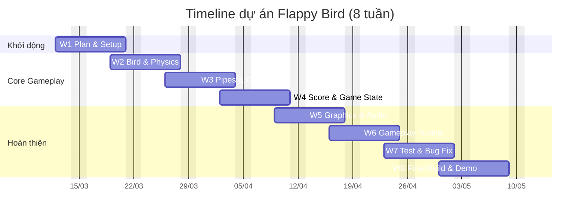

# Proposal Cơ sở lập trình
## A. Thông tin
### 1. Thông tin chung
**Tên môn:** Cơ sở lập trình
**Tên đề tài:** Game Flappy Bird
**Thời gian thực hiện:** 8 tuần từ 12/3/2026

### 2. Thông tin nhóm

| MSSV     |      Họ tên       | Email(github)                |
| -------- |:-----------------:| ---------------------------- |
| 24127175 | Lê Đoàn Nhật Huy  | ldnhuy2429@clc.fitus.edu.vn                             |
| 24127196 | Trần Vũ Anh Kiệt  | tvakiet2429@clc.fitus.edu.vn |
| 24127233 | Nguyễn Trường Sơn | daynuitruongson@gmail.com    |

## B. Tổng quan đề tài
### 1. Mô tả đề tài
#### 1.1. Giới thiệu đề tài
Đề tài của nhóm là xây dựng trò chơi **Flappy Bird** dưới dạng game 2D đơn giản.

Người chơi điều khiển một chú chim bay qua các cặp chướng ngại vật (ống cản) xuất hiện liên tục từ phải sang trái. Nhiệm vụ là nhấn phím (hoặc click chuột) để chim vỗ cánh bay lên, tránh va chạm với ống hoặc rơi xuống đất. Mỗi lần vượt qua một cặp ống, người chơi được cộng 1 điểm. Trò chơi kết thúc khi chim va chạm và hiển thị điểm số đạt được.
#### 1.2. Lý do chọn đề tài
Nhóm chọn đề tài này vì:
- Luật chơi cực kỳ đơn giản, dễ mô tả và dễ kiểm thử kết quả, phù hợp với trình độ.
- Đáp ứng được yêu cầu vận dụng các kiến thức, yêu cầu đầu ra của môn Cơ sở lập trình.
- Thời lượng thực hiện phù hợp với 8 tuần học phần, không quá phức tạp nhưng vẫn đủ để rèn luyện

### 2. Bối cảnh và vấn đề đặt ra

Trong môn Cơ sở lập trình, sinh viên thường làm các bài tập nhỏ và rời rạc như điều kiện, vòng lặp, hàm hoặc mảng. Cách học này giúp xây dựng nền tảng, nhưng chưa tạo nhiều cơ hội để kết nối các kiến thức đó thành một chương trình hoàn chỉnh có luồng hoạt động rõ ràng.

Vì vậy, nhóm cần một bài toán đủ nhỏ để phù hợp với thời lượng 8 tuần, nhưng vẫn đủ tiêu biểu để thể hiện các thành phần cốt lõi của lập trình ứng dụng. Nhóm chọn game Flappy Bird vì trò chơi này có luật chơi đơn giản, dễ mô tả, dễ kiểm thử, nhưng vẫn yêu cầu xử lý nhiều nội dung quan trọng như input, chuyển động, quản lý trạng thái, va chạm, tính điểm và tổ chức mã nguồn.

Thông qua đề tài này, nhóm muốn vận dụng các kiến thức lập trình cơ bản để xây dựng một sản phẩm hoàn chỉnh, đồng thời thực hành quy trình phát triển phần mềm ở mức cơ bản như phân tích yêu cầu, lập trình, kiểm thử, sửa lỗi và làm việc nhóm qua Git/GitHub.

### 3. Đối tượng sử dụng và mục đích:
- **Đối tượng sử dụng sản phẩm:** Người chơi cuối, chủ yếu là học sinh/sinh viên muốn giải trí nhanh và thử phản xạ.
- **Các bên liên quan:** Giảng viên là người đánh giá kết quả học tập; nhóm thực hiện là bên phát triển, kiểm thử và bảo trì mã nguồn trong phạm vi môn học.
### 4. Mục tiêu & tiêu chí thành công
#### 4.1. Mục tiêu tổng quát
Xây dựng một phiên bản game Flappy Bird 2D cơ bản hoàn chỉnh bằng C++ và SFML, cho phép người chơi điều khiển chú chim vượt qua các chướng ngại vật (ống cản), ghi điểm và trải nghiệm gameplay ổn định. Thông qua dự án, nhóm áp dụng toàn diện kiến thức môn Cơ sở lập trình vào một ứng dụng thực tế, đồng thời rèn luyện kỹ năng phân tích yêu cầu, tổ chức mã nguồn, làm việc nhóm và quản lý tiến độ qua Git/GitHub trong 8 tuần.
#### 4.2. Mục tiêu cụ thể
- Triển khai cơ chế điều khiển: chim bay lên khi nhấn phím, rơi tự nhiên do trọng lực
- Sinh và di chuyển chướng ngại vật (ống cản) liên tục và từ phải sang trái với khoảng cách ngẫu nhiên
- Xây dựng hệ thống kiểm tra va chạm, xử lý game over và tính điểm chính xác
- Hoàn thành sản phẩm đúng tiến độ 8 tuần.
#### 4.3. Tiêu chí thành công

Nhóm xây dựng tiêu chí thành công theo hướng có thể kiểm tra được bằng kết quả chạy thử, quan sát trực tiếp trên sản phẩm và đối chiếu với tiến độ thực hiện.

| Nhóm tiêu chí | Tiêu chí thành công | Cách kiểm tra / điều kiện đạt |
|---|---|---|
| Sản phẩm | Game chạy ổn định trên máy demo của nhóm, không bị crash trong quá trình sử dụng thông thường | Chạy liên tục ít nhất 10 phút hoặc chơi thử tối thiểu 15 lượt liên tiếp mà không xuất hiện crash, treo chương trình hoặc lỗi làm game không thể tiếp tục |
| Sản phẩm | Luồng chơi hoàn chỉnh và đúng logic | Người dùng có thể thực hiện đầy đủ chuỗi thao tác: mở game → vào màn hình bắt đầu → bắt đầu chơi → va chạm → game over → chơi lại, và chuỗi này lặp lại đúng trong ít nhất 5 lần thử liên tiếp |
| Sản phẩm | Cơ chế điều khiển, va chạm và tính điểm hoạt động chính xác | Khi nhấn phím điều khiển, chim phản hồi đúng; khi chim chạm ống cản hoặc mặt đất thì game chuyển sang game over; điểm chỉ tăng đúng 1 lần cho mỗi cặp ống cản vượt qua. Các tình huống này phải được kiểm thử và cho kết quả đúng trong toàn bộ test case nhóm đặt ra |
| Sản phẩm | Trải nghiệm chơi đủ mượt để sử dụng và demo | Hình ảnh được cập nhật liên tục, không giật hoặc đứng khung rõ rệt trong quá trình chơi thông thường; thao tác điều khiển không bị trễ đến mức làm ảnh hưởng rõ ràng đến gameplay trên máy demo của nhóm |
| Sản phẩm | Giao diện đủ rõ để người chơi mới có thể sử dụng ngay | Màn hình bắt đầu phải thể hiện được cách bắt đầu chơi; trong lúc chơi phải nhìn thấy điểm số; khi thua phải hiển thị trạng thái game over và cách chơi lại. Người xem lần đầu có thể hiểu cách thao tác cơ bản mà không cần giải thích quá nhiều |
| Sản phẩm | Có thể demo ổn định trong buổi báo cáo | Nhóm có thể mở game, chơi thử, thua và chơi lại trực tiếp trong buổi báo cáo mà không cần sửa code hoặc cấu hình lại hệ thống tại chỗ |
| Quá trình | Mã nguồn được tổ chức rõ ràng, dễ theo dõi và dễ chỉnh sửa | Mã nguồn được chia thành các thành phần hợp lý như quản lý trạng thái game, chim, ống cản, va chạm, điểm số; tên file và tên hàm đủ rõ nghĩa; có README hoặc hướng dẫn build/chạy cơ bản |
| Quá trình | Quy trình làm việc nhóm qua Git/GitHub thể hiện được sự tham gia của các thành viên | Repo có lịch sử commit rõ ràng; mỗi thành viên đều có đóng góp thực tế vào code, tài liệu hoặc kiểm thử; lịch sử làm việc cho thấy dự án được phát triển theo nhiều bước chứ không dồn toàn bộ vào cuối kỳ |
| Quá trình | Các hạng mục cốt lõi được hoàn thành đúng tiến độ chính | Toàn bộ các chức năng Must-have (F1–F6) phải hoàn thành trước giai đoạn tổng kết cuối; nếu có điều chỉnh tiến độ thì vẫn không làm ảnh hưởng đến khả năng hoàn thành MVP đúng hạn |
| Quá trình | Sản phẩm phù hợp với mục tiêu môn học và phạm vi proposal đã cam kết | Sản phẩm hoàn thiện được phần gameplay cốt lõi, thể hiện được các nội dung lập trình chính như xử lý sự kiện, vòng lặp game, quản lý trạng thái, va chạm, tính điểm và tổ chức mã nguồn theo đúng phạm vi nhóm đã đề xuất |                                         |
### 5. Phạm vi dự án
Trong phạm vi 8 tuần của môn học, nhóm cam kết hoàn thành một phiên bản MVP (Minimum Viable Product) của game Flappy Bird, tập trung vào các chức năng cốt lõi từ F1 đến F6. Đây là các chức năng bắt buộc để trò chơi có thể chạy hoàn chỉnh, chơi được từ đầu đến cuối và đủ cơ sở để demo, đánh giá và tiếp tục cải tiến.

Các chức năng từ F7 đến F11 được xem là phần mở rộng nhằm nâng cao trải nghiệm người chơi. Nhóm chỉ triển khai các chức năng này khi phần gameplay cốt lõi đã ổn định, được kiểm thử ở mức chấp nhận được và vẫn còn đủ quỹ thời gian trong kế hoạch thực hiện.

#### 5.1. In Scope
Trong phạm vi thực hiện chính, nhóm tập trung phát triển các thành phần cốt lõi để tạo ra một phiên bản Flappy Bird hoàn chỉnh ở mức MVP, bao gồm:

- Điều khiển chim bằng bàn phím/click để bay lên và rơi xuống theo cơ chế trọng lực
- Sinh và di chuyển các chướng ngại vật (ống cản) liên tục từ phải sang trái
- Phát hiện va chạm giữa chim với chướng ngại vật (ống cản) hoặc mặt đất
- Tính điểm khi người chơi vượt qua chướng ngại vật (ống cản)
- Màn hình bắt đầu trò chơi
- Màn hình game over và chức năng chơi lại
- Tổ chức mã nguồn theo cấu trúc rõ ràng, dễ quản lý và dễ mở rộng
- Hoàn thiện một bản game có thể chạy ổn định để demo trong phạm vi môn học

#### 5.2. Out of Scope
Các nội dung sau không thuộc phạm vi bắt buộc của phiên bản MVP:

- Chế độ nhiều người chơi
- Bảng xếp hạng trực tuyến
- Đồng bộ dữ liệu qua mạng hoặc lưu trữ online
- Tài khoản người dùng hoặc phân quyền hệ thống
- Tùy biến nhân vật, giao diện hoặc vật phẩm ở mức phức tạp
- Các hiệu ứng đồ họa nâng cao không ảnh hưởng trực tiếp đến gameplay cốt lõi

#### 5.3. Ghi chú phạm vi
Các chức năng như tạm dừng trò chơi, âm thanh, lưu điểm cao nhất cục bộ, tăng độ khó theo thời gian hoặc các hiệu ứng hoàn thiện thêm được xem là phần mở rộng. Những chức năng này không phải điều kiện bắt buộc để sản phẩm đạt mức MVP, và sẽ chỉ được triển khai nếu nhóm còn đủ thời gian sau khi hoàn thành phần lõi.
### 6. Giả định & ràng buộc
#### 6.1. Giả định
Trong quá trình thực hiện dự án, nhóm đưa ra một số giả định để đảm bảo việc phát triển sản phẩm diễn ra thuận lợi và phù hợp với phạm vi môn học:

- Người chơi đã có các thao tác cơ bản với bàn phím để điều khiển trò chơi.
- Trò chơi được chạy trên máy tính cá nhân với môi trường phù hợp để biên dịch và thực thi chương trình.
- Các thành viên trong nhóm đều có thể sử dụng Git/GitHub ở mức cơ bản để quản lý mã nguồn và phối hợp làm việc.
- Các tài nguyên sử dụng trong game như hình ảnh, âm thanh hoặc font chữ nếu có đều ở mức đơn giản, dễ tích hợp và không gây ảnh hưởng lớn đến tiến độ phát triển.
- Đề tài được phát triển theo hướng ưu tiên hoàn thiện gameplay cốt lõi trước, sau đó mới xem xét các tính năng mở rộng nếu còn thời gian.

#### 6.2. Ràng buộc
Dự án chịu một số ràng buộc về thời gian, phạm vi và kỹ thuật như sau:
- Thời gian thực hiện dự án là 8 tuần, do đó nhóm phải giới hạn phạm vi ở mức phù hợp và ưu tiên các chức năng cốt lõi.
- Dự án phục vụ cho môn Cơ sở lập trình, vì vậy giải pháp phải phù hợp với kiến thức nền tảng đã học, tránh phụ thuộc quá nhiều vào công nghệ phức tạp vượt ngoài yêu cầu môn học.
- Nhóm cần đảm bảo mọi thành viên đều có đóng góp rõ ràng, có minh chứng thông qua commit, pull request và các phần việc được phân công.
- Sản phẩm cuối cùng phải có thể chạy được ổn định để phục vụ demo và báo cáo với giảng viên.
- Các tính năng nâng cao như chơi mạng, bảng xếp hạng trực tuyến, lưu dữ liệu online hoặc đồ họa phức tạp sẽ không được ưu tiên nếu ảnh hưởng đến tiến độ hoàn thành MVP.
- Việc lựa chọn công cụ, thư viện và cách tổ chức chương trình phải đảm bảo nhóm có khả năng học và triển khai trong thời gian cho phép.

## C. Chức năng hệ thống
### 1. Phân tích đề tài và định hướng chức năng
Đề tài Flappy Bird có độ khó ở mức thấp đến trung bình, phù hợp với thời gian thực hiện 8 tuần của môn Cơ sở lập trình. Giá trị của đề tài không nằm ở độ phức tạp thuật toán mà ở việc hiện thực đầy đủ một vòng lặp game cơ bản, từ xử lý input đến cập nhật trạng thái và hiển thị kết quả.

Sơ đồ vòng lặp:
Input → Cập nhật vật lý → Sinh chướng ngại vật (ống cản) → Kiểm tra va chạm → Cập nhật điểm → Render màn hình

| Tiêu chí             | Đánh giá                                                                                            |
| -------------------- | --------------------------------------------------------------------------------------------------- |
| Mức độ khó           | Thấp đến trung bình, phù hợp với thời gian 8 tuần của môn Cơ sở lập trình                           |
| Giá trị học thuật    | Rèn luyện phân tích yêu cầu, thiết kế thuật toán, tổ chức chương trình theo module và kiểm thử      |
| Lõi kỹ thuật         | Nhận input, cập nhật vật lý, sinh chướng ngại vật (ống cản), kiểm tra va chạm, cập nhật điểm, render màn hình |
| Điểm mạnh            | Luật chơi đơn giản, tiêu chí đúng/sai rõ ràng, dễ demo                                              |
| Rủi ro chính         | Mở rộng quá nhiều tính năng phụ làm vượt phạm vi và ảnh hưởng tiến độ                               |
| Định hướng thực hiện | Khóa MVP ở gameplay cốt lõi, ưu tiên độ ổn định trước khi mở rộng                                   |
| Ghi chú thuật ngữ    | “Backend” trong proposal được hiểu là lõi xử lý game, không phải backend server                     |

### 2. Danh sách chức năng chi tiết
| ID  | Chức năng | Mô tả ngắn |
| --- | --------- | ---------- |
| F1  | Khởi tạo game và quản lý trạng thái | Hiển thị màn hình bắt đầu, vào game, game over và chuyển đổi giữa các trạng thái chơi. |
| F2  | Điều khiển chim và mô phỏng trọng lực | Chim bay lên khi người chơi nhấn phím/click và rơi xuống tự nhiên theo trọng lực. |
| F3  | Sinh và di chuyển chướng ngại vật (ống cản) | Tạo các cặp ống theo chu kỳ, vị trí ngẫu nhiên trong giới hạn hợp lý và di chuyển từ phải sang trái. |
| F4  | Kiểm tra va chạm và xử lý thua | Phát hiện va chạm giữa chim với ống hoặc mặt đất, sau đó chuyển sang trạng thái game over. |
| F5  | Tính điểm và hiển thị điểm số | Cộng điểm khi người chơi vượt qua một cặp ống và hiển thị điểm theo thời gian thực. |
| F6  | Chơi lại / reset ván chơi | Cho phép bắt đầu lại nhanh sau khi thua và đưa toàn bộ trạng thái game về mặc định. |
| F7  | Tạm dừng / tiếp tục trò chơi | Cho phép pause để tạm dừng gameplay và resume khi người chơi muốn tiếp tục. |
| F8  | Âm thanh và phản hồi hình ảnh cơ bản | Bổ sung âm thanh flap, va chạm, điểm số và hiệu ứng hình ảnh đơn giản để tăng trải nghiệm. |
| F9  | Lưu điểm cao cục bộ | Lưu high score vào file cục bộ để người chơi có thể so sánh thành tích giữa các lần chơi. |
| F10 | Tăng dần độ khó theo điểm | Điều chỉnh nhẹ tốc độ hoặc khoảng cách ống khi điểm tăng để gameplay bớt đơn điệu. |
| F11 | Hoàn thiện giao diện và hiệu ứng hình ảnh nhẹ | Thay đổi nền, sprite hoặc màu sắc cơ bản nếu còn thời gian sau khi hoàn thiện MVP. |

### 3. Danh sách chức năng theo mức ưu tiên
#### 3.1. Must-have (MVP)
1. **F1 - Khởi tạo game và quản lý trạng thái**  
   Đây là khung điều phối của toàn bộ chương trình. Nếu chưa có state `Start / Playing / GameOver` thì các chức năng khác khó gắn kết thành một luồng chơi hoàn chỉnh.

2. **F2 - Điều khiển chim và mô phỏng trọng lực**  
   Đây là cơ chế cốt lõi tạo nên gameplay. Nếu không hoàn thiện phần này thì dự án chưa thể được xem là Flappy Bird đúng nghĩa.

3. **F3 - Sinh và di chuyển chướng ngại vật (ống cản)**  
   chướng ngại vật (ống cản) là thử thách chính trong game. Chức năng này quyết định trực tiếp đến độ khó và nhịp chơi.

4. **F4 - Kiểm tra va chạm và xử lý thua**  
   Bảo đảm điều kiện kết thúc game rõ ràng, đúng logic và có thể kiểm thử được.

5. **F5 - Tính điểm và hiển thị điểm số**  
   Đây là phản hồi quan trọng nhất đối với người chơi, đồng thời là tiêu chí để đánh giá game chạy đúng hay chưa.

6. **F6 - Chơi lại / reset ván chơi**  
   Giúp game có vòng lặp sử dụng hoàn chỉnh: chơi -> thua -> chơi lại. Đây là thành phần cần thiết để demo và kiểm thử nhiều lần.

#### 3.2. Should-have
1. **F7 - Tạm dừng / tiếp tục trò chơi**  
   Không bắt buộc để tạo ra MVP, nhưng giúp trải nghiệm chơi hoàn chỉnh hơn và thể hiện khả năng quản lý state tốt hơn.

2. **F8 - Âm thanh và phản hồi hình ảnh cơ bản**  
   Tăng cảm giác tương tác, làm sản phẩm bớt khô và chuyên nghiệp hơn khi demo.

3. **F9 - Lưu điểm cao cục bộ**  
   Là mở rộng hợp lý, dễ triển khai bằng file local và không làm scope phình quá lớn.

#### 3.3. Could-have
1. **F10 - Tăng dần độ khó theo điểm**  
   Chỉ nên làm khi MVP đã ổn định vì cần thêm thời gian tinh chỉnh để gameplay không bị quá dễ hoặc quá khó.

2. **F11 - Tùy biến giao diện nhẹ**  
   Có thể nâng chất lượng trình bày khi demo nhưng không ảnh hưởng đến logic cốt lõi, do đó chỉ nên triển khai sau cùng.

### 4. Phân tích tính phù hợp và khả thi trong phạm vi 8 tuần
| ID  | Chức năng | Ưu tiên | Mức phù hợp trong 8 tuần | Tính khả thi và lý do | Cần những gì để triển khai |
| --- | --------- | ------- | ------------------------ | --------------------- | -------------------------- |
| F1  | Khởi tạo game và quản lý trạng thái | Must | Rất phù hợp | **Khả thi cao** vì chỉ cần mô hình state đơn giản (`Start`, `Playing`, `GameOver`) và xử lý sự kiện chuyển state. | C++17, SFML Window/Graphics, font chữ, asset màn hình cơ bản, GitHub để chia việc. |
| F2  | Điều khiển chim và mô phỏng trọng lực | Must | Rất phù hợp | **Khả thi cao** vì có thể cài đặt bằng công thức vận tốc - gia tốc cơ bản; logic ngắn, dễ kiểm thử độc lập. | C++17, SFML Event/Input, biến vận tốc và gia tốc, game loop, module `Bird`. |
| F3  | Sinh và di chuyển chướng ngại vật (ống cản) | Must | Phù hợp | **Khả thi cao** vì chỉ cần timer sinh ống, random độ cao trong ngưỡng và cập nhật vị trí theo thời gian. | C++17 STL (`vector`, `random`), SFML Graphics, module `PipeManager`, asset ống. |
| F4  | Kiểm tra va chạm và xử lý thua | Must | Rất phù hợp | **Khả thi cao** vì dùng va chạm hình chữ nhật/hitbox cơ bản là đủ cho đề tài; không cần vật lý phức tạp. | SFML `FloatRect`/bounding box, module `Collision`, state `GameOver`, test case va chạm. |
| F5  | Tính điểm và hiển thị điểm số | Must | Rất phù hợp | **Khả thi cao** vì chỉ cần đánh dấu mỗi cặp ống đã được tính điểm hay chưa và render text lên màn hình. | Module `Score`, SFML Text, cờ trạng thái `passed`, font chữ. |
| F6  | Chơi lại / reset ván chơi | Must | Rất phù hợp | **Khả thi cao** vì chủ yếu là reset vị trí chim, danh sách ống, điểm và trạng thái game. | Hàm `resetGame()`, module `GameState`, tái khởi tạo object, test luồng restart. |
| F7  | Tạm dừng / tiếp tục trò chơi | Should | Phù hợp | **Khả thi khá cao** vì chỉ cần thêm state `Paused` và dừng cập nhật logic khi pause. | State machine, xử lý phím pause, SFML Text/UI cho thông báo tạm dừng. |
| F8  | Âm thanh và phản hồi hình ảnh cơ bản | Should | Phù hợp nếu MVP xong sớm | **Khả thi trung bình - cao** nếu dùng asset âm thanh ngắn và hiệu ứng đơn giản; không nên làm quá nhiều animation. | SFML Audio, file âm thanh `.wav/.ogg`, asset sprite, công cụ chỉnh sửa asset đơn giản. |
| F9  | Lưu điểm cao cục bộ | Should | Phù hợp | **Khả thi cao** vì chỉ cần đọc/ghi file text đơn giản, không cần database hay mạng. | `fstream`, file `highscore.txt`, kiểm tra dữ liệu hợp lệ, README hướng dẫn chạy. |
| F10 | Tăng dần độ khó theo điểm | Could | Chỉ phù hợp khi còn buffer | **Khả thi trung bình** nhưng cần tinh chỉnh tham số để tránh phá hỏng trải nghiệm; nên làm sau cùng. | Biến cấu hình tốc độ/spawn rate, bảng tham số difficulty, playtest. |
| F11 | Tùy biến giao diện nhẹ | Could | Phù hợp nếu còn thời gian | **Khả thi trung bình** vì phụ thuộc nhiều vào thời gian chuẩn bị asset hơn là thuật toán. | Asset nền/sprite thay thế, module UI, công cụ chỉnh ảnh cơ bản. |

**Kết luận về tính khả thi:** Với phạm vi 8 tuần, nhóm nên khóa MVP ở **F1 -> F6** trong giai đoạn đầu. Sau khi MVP chạy ổn định, nhóm mới mở rộng sang **F7 -> F9**. Hai chức năng **F10 -> F11** chỉ nên thực hiện khi còn thời gian dự phòng.

### 5. Bảng phân chức năng và ánh xạ chuẩn đầu ra
#### 5.1. Bảng ánh xạ chức năng – chuẩn đầu ra

| ID  | Chức năng | Mô tả | Role | Ưu tiên | Deliverable (minh chứng) | Chuẩn đầu ra (đề xuất) |
| --- | --------- | ----- | ---- | ------- | ------------------------ | ---------------------- |
| F1  | Khởi tạo game và quản lý trạng thái | Tổ chức các state `Start / Playing / GameOver` và điều hướng luồng chơi | Player | Must | Màn hình start/game over, module `GameState`, demo chuyển trạng thái | CĐR1, CĐR3 |
| F2  | Điều khiển chim và mô phỏng trọng lực | Xử lý input và cập nhật chuyển động của chim | Player | Must | Module `Bird`, video demo điều khiển, commit chức năng | CĐR2, CĐR3 |
| F3  | Sinh và di chuyển chướng ngại vật (ống cản) | Quản lý sinh ống, vị trí, tốc độ và xóa ống cũ | Player | Must | Module `PipeManager`, demo obstacle loop | CĐR2, CĐR3 |
| F4  | Kiểm tra va chạm và xử lý thua | Xác định điều kiện thua và kết thúc ván | Player | Must | Module collision, test case va chạm, màn hình game over | CĐR2, CĐR3, CĐR4 |
| F5  | Tính điểm và hiển thị điểm số | Cộng điểm đúng logic và hiển thị realtime | Player | Must | HUD điểm số, demo gameplay, commit chức năng | CĐR2, CĐR3 |
| F6  | Chơi lại / reset ván chơi | Đưa hệ thống về trạng thái mặc định để chơi lại | Player | Must | Nút/phím restart, video demo luồng restart | CĐR3, CĐR4 |
| F7  | Tạm dừng / tiếp tục trò chơi | Tạm ngưng và tiếp tục game mà không mất state hiện tại | Player | Should | Demo pause/resume, commit liên quan | CĐR3, CĐR4 |
| F8  | Âm thanh và phản hồi hình ảnh cơ bản | Tăng trải nghiệm bằng âm thanh và hiệu ứng trực quan | Player | Should | Bộ asset âm thanh, video demo, screenshot | CĐR3 |
| F9  | Lưu điểm cao cục bộ | Ghi/đọc high score từ file local | Player | Should | File high score, module lưu dữ liệu, demo lưu điểm | CĐR3, CĐR4 |
| F10 | Tăng dần độ khó theo điểm | Điều chỉnh tham số gameplay theo tiến trình chơi | Player | Could | File cấu hình/difficulty logic, video demo | CĐR2, CĐR3 |
| F11 | Tùy biến giao diện nhẹ | Mở rộng nền/sprite để tăng tính trực quan | Player | Could | Screenshot các giao diện/asset thay thế | CĐR3 |

#### 5.2. Diễn giải bộ chuẩn đầu ra tham chiếu
- **CĐR1:** Phân tích bài toán, xác định yêu cầu và mô hình hóa chức năng.
- **CĐR2:** Thiết kế thuật toán và lựa chọn cấu trúc dữ liệu phù hợp.
- **CĐR3:** Hiện thực chương trình có cấu trúc, module hóa và xử lý được luồng chạy chính.
- **CĐR4:** Kiểm thử, debug, đánh giá tính đúng và độ ổn định của chương trình.
- **CĐR5:** Làm việc nhóm, quản lý phiên bản và phối hợp triển khai qua Git/GitHub.

> **Gợi ý sử dụng trong proposal tổng:** CĐR5 nên được minh chứng ở phần quy trình làm việc nhóm, lịch sử commit, branch, pull request và phân công công việc hơn là gắn vào một chức năng gameplay cụ thể.

## D. Yêu cầu phi chức năng và công nghệ
### 1. Yêu cầu phi chức năng
#### 1.1. Hiệu năng
- Game duy trì tốc độ hiển thị ổn định ở mức **tối thiểu 30 FPS** trên máy tính học tập thông thường.
- Thao tác nhấn phím/click tạo phản hồi gần như tức thời, không gây cảm giác trễ đầu vào.
- Việc sinh thêm ống mới không làm game giật hoặc đứng hình kéo dài.

**Cách chứng minh:** demo trực tiếp, FPS counter/debug log, quan sát khi chạy liên tục nhiều vòng chơi.

#### 1.2. Tính ổn định và tính đúng
- Game không crash trong các phiên chơi thử liên tục.
- Điểm số tăng **đúng 1 lần** cho mỗi cặp ống được vượt qua.
- Va chạm với ống hoặc mặt đất phải luôn đưa game vào trạng thái `GameOver` đúng lúc.
- Chức năng restart phải reset đúng toàn bộ state mà không cần tắt mở lại chương trình.

**Cách chứng minh:** bộ test case cho va chạm, tính điểm, restart; video demo các tình huống biên.

#### 1.3. Khả dụng (Usability)
- Luật chơi dễ hiểu, người chơi mới có thể bắt đầu trong thời gian ngắn.
- Giao diện hiển thị rõ ràng, dễ phân biệt trạng thái `Start`, `Playing`, `Paused`, `GameOver`.
- Số thao tác để bắt đầu lại sau khi thua ở mức tối thiểu.

**Cách chứng minh:** demo cho người dùng thử, screenshot giao diện, mô tả luồng thao tác trong tài liệu.

#### 1.4. Khả năng bảo trì và mở rộng
- Mã nguồn được tách thành các module rõ ràng như `Bird`, `PipeManager`, `Collision`, `Score`, `GameState`, `UI`.
- Tên biến, tên hàm nhất quán; các đoạn xử lý quan trọng có chú thích ngắn gọn.
- Có README hướng dẫn cách build, chạy và cấu trúc thư mục dự án.

**Cách chứng minh:** cấu trúc repo, README, lịch sử commit, code review nội bộ.

#### 1.5. Tính tương thích môi trường
- Chương trình phải chạy ổn định trên môi trường máy tính mà nhóm dùng để học và demo.
- Việc cài đặt thư viện cần đủ đơn giản để các thành viên khác có thể clone repo và chạy lại.

**Cách chứng minh:** kiểm thử trên nhiều máy trong nhóm, hướng dẫn cài đặt ngắn gọn trong README.

#### 1.6. Bảo mật và dữ liệu
- Dự án **không xử lý tài khoản hoặc dữ liệu nhạy cảm**, nên không đặt trọng tâm vào bảo mật theo mô hình web app.
- Nếu có chức năng lưu high score cục bộ, dữ liệu đọc từ file cần được kiểm tra hợp lệ ở mức cơ bản để tránh lỗi chương trình.

**Cách chứng minh:** mã xử lý file đơn giản, kiểm tra giá trị đầu vào và test trường hợp file lỗi/không tồn tại.

### 2. Công nghệ dự kiến
#### 2.1. Định hướng công nghệ
Với mục tiêu hoàn thành trong 8 tuần và phù hợp với môn Cơ sở lập trình, nhóm đề xuất triển khai game theo hướng **desktop 2D offline**, ưu tiên stack gọn, dễ học và dễ kiểm thử.

#### 2.2. Lớp hiển thị và tương tác
- **SFML Graphics / Window / Audio** dùng để tạo cửa sổ game, render sprite, hiển thị text và nhận input từ bàn phím/chuột.
- **UI đơn giản** gồm màn hình bắt đầu, màn hình chơi, màn hình game over, điểm số và thông báo pause.
- **Asset cục bộ**: hình ảnh sprite, nền, font chữ và âm thanh ngắn lưu trực tiếp trong project.

#### 2.3. Lõi xử lý game
- **C++17** làm ngôn ngữ chính để hiện thực toàn bộ game logic.
- **STL** (`vector`, `string`, `random`, `fstream`) phục vụ quản lý danh sách ống, random vị trí, lưu điểm cao cục bộ.
- Các module lõi dự kiến:
  - `GameState`: quản lý luồng `Start / Playing / Paused / GameOver`
  - `Bird`: điều khiển nhân vật, trọng lực, vận tốc, trạng thái bay
  - `PipeManager`: sinh, cập nhật và hủy các cặp ống
  - `Collision`: kiểm tra va chạm giữa chim với ống/đất
  - `Score`: cập nhật điểm và high score
  - `UI`: text, hướng dẫn, thông báo game over/pause

#### 2.4. Database
- **Không sử dụng database** trong phạm vi MVP.
- Nếu có lưu high score, dữ liệu chỉ được lưu bằng **file cục bộ** đơn giản.

#### 2.5. API / Website / Dịch vụ ngoài
- **Không sử dụng external API** hoặc dịch vụ mạng trong phiên bản MVP.
- **GitHub** được dùng để lưu trữ mã nguồn, quản lý phiên bản, theo dõi đóng góp và phối hợp làm việc nhóm.

#### 2.6. Công cụ hỗ trợ phát triển
- **Git & GitHub**: quản lý source code, branch, pull request, review và theo dõi đóng góp.
- **Visual Studio Code / Visual Studio / g++**: môi trường lập trình và biên dịch.
- **draw.io hoặc Figma** (nếu cần): phác thảo nhanh luồng màn hình hoặc cấu trúc module.
- **Markdown**: viết tài liệu proposal, README và ghi chú kỹ thuật.

#### 2.7. Lý do chọn stack
- Phù hợp với bản chất của đề tài là **game 2D offline**, không cần backend server.
- Stack gọn, tài nguyên triển khai ít, phù hợp với nhóm sinh viên và tiến độ 8 tuần.
- Dễ chia việc theo module cho các thành viên và dễ chứng minh tính khả thi trong proposal.
- Dễ kiểm thử từng phần độc lập: điều khiển chim, sinh ống, va chạm, điểm số, restart.

## E. Kế hoạch thực hiện
### 1. Kế hoạch thực hiện 8 tuần
#### 1.1. Tổng quan timeline
| Tuần   | Thời gian   | Chủ đề                           | Kết quả chính                                                                                                  |
| ------ | ----------- | -------------------------------- | -------------------------------------------------------------------------------------------------------------- |
| Tuần 1 | 12/3 – 18/3 | Lên kế hoạch & thiết lập dự án   | Hoàn tất repo GitHub, cài đặt môi trường C++/SFML, thống nhất cấu trúc thư mục và hoàn thành GDD phiên bản đầu |
| Tuần 2 | 19/3 – 25/3 | Cơ chế chính (nhân vật & vật lý) | Nhân vật có thể di chuyển, vỗ cánh, chịu trọng lực và rơi ổn định theo đúng gameplay mong muốn                 |
| Tuần 3 | 26/3 – 1/4  | chướng ngại vật (ống cản) & va chạm        | Ống nước được sinh tự động, di chuyển liên tục và hệ thống phát hiện va chạm hoạt động đúng                    |
| Tuần 4 | 2/4 – 8/4   | Hệ thống điểm & trạng thái game  | Hoàn thiện luồng chơi cơ bản gồm màn hình bắt đầu, tính điểm, game over, chơi lại và lưu best score            |
| Tuần 5 | 9/4 – 15/4  | Đồ họa & âm thanh                | Tích hợp sprite, animation cơ bản, âm thanh và nhạc nền để hoàn thiện trải nghiệm chơi                         |
| Tuần 6 | 16/4 – 22/4 | Hoàn thiện gameplay              | Tinh chỉnh tốc độ, khoảng cách ống, độ khó và xử lý các lỗi lớn ảnh hưởng đến trải nghiệm                      |
| Tuần 7 | 23/4 – 29/4 | Kiểm thử & sửa lỗi               | Thực hiện playtest, kiểm tra các chức năng chính, sửa lỗi và ổn định phiên bản gần cuối                        |
| Tuần 8 | 30/4 – 6/5  | Đóng gói & hoàn thiện sản phẩm   | Hoàn tất bản build cuối, tài liệu hướng dẫn chạy, video demo và chuẩn bị sản phẩm để nộp/báo cáo               |
#### 1.2. Sơ đồ timeline

#### 1.3. Ghi chú cách triển khai
Nhóm triển khai dự án theo hướng ưu tiên hoàn thành gameplay cốt lõi trong các tuần đầu, sau đó mới bổ sung giao diện, âm thanh, kiểm thử và đóng gói sản phẩm. Kế hoạch chi tiết theo từng đầu việc sẽ được nhóm quản lý nội bộ thông qua backlog và checklist hằng tuần để đảm bảo tiến độ thực tế.
Kế hoạch chi tiết từng tuần được chi tiết: https://www.notion.so/Timeline-L-m-Game-Flappy-Bird-d9ca68638b3b4e5fadc63a0f76d9c33d?pvs=11

### 2. Rủi ro và phương án giảm thiểu

| Rủi ro                                          | Mức độ     | Ảnh hưởng                                                   | Phương án giảm thiểu                                                                                                                | Phương án dự phòng                                                                                                          |
| ----------------------------------------------- | ---------- | ----------------------------------------------------------- | ----------------------------------------------------------------------------------------------------------------------------------- | --------------------------------------------------------------------------------------------------------------------------- |
| Scope creep (phạm vi bị mở rộng quá mức)        | Cao        | Làm chậm tiến độ, không kịp hoàn thành gameplay cốt lõi     | Chốt rõ phạm vi MVP ngay từ đầu, ưu tiên hoàn thành các chức năng bắt buộc trước                                                    | Nếu tiến độ chậm, tạm hoãn hoặc loại bỏ các tính năng phụ như animation nâng cao, hiệu ứng hoặc tùy biến thêm               |
| Thiếu asset phù hợp                             | Trung bình | Làm chậm quá trình hoàn thiện giao diện và trải nghiệm      | Sử dụng tạm placeholder/free asset từ các nguồn như OpenGameArt, Kenney trong giai đoạn phát triển                                  | Nếu chưa có asset cuối, nhóm vẫn tiếp tục phát triển gameplay bằng asset tạm để không ảnh hưởng tiến độ                     |
| Bug khó xử lý                                   | Cao        | Ảnh hưởng đến độ ổn định của game và làm chậm các phần khác | Giới hạn thời gian xử lý một bug trong một khoảng hợp lý, ưu tiên debug theo mức độ nghiêm trọng và giữ code ở trạng thái chạy được | Nếu chưa xử lý xong, tạo issue để theo dõi, tạm vô hiệu hóa tính năng phụ liên quan hoặc quay về phiên bản ổn định gần nhất |
| Trễ tiến độ                                     | Cao        | Dồn việc vào cuối kỳ, giảm chất lượng sản phẩm              | Review tiến độ hằng tuần, chia task nhỏ và theo dõi bằng backlog hoặc checklist                                                     | Nếu trễ kế hoạch, nhóm sẽ cắt bớt các chức năng mở rộng và tập trung hoàn thiện bản MVP                                     |
| Chưa quen thư viện SFML hoặc công cụ phát triển | Trung bình | Chậm ở giai đoạn đầu, ảnh hưởng tiến độ các tuần sau        | Dành tuần đầu để nghiên cứu, thử nghiệm prototype nhỏ và thống nhất cách tổ chức project                                            | Nếu gặp khó khăn kéo dài, nhóm sẽ giảm bớt các phần nâng cao và ưu tiên hoàn thành gameplay cơ bản                          |
| Xung đột code khi làm việc nhóm                 | Trung bình | Mất thời gian merge, dễ phát sinh lỗi ngoài ý muốn          | Quy định làm việc qua branch riêng, commit rõ ràng, review trước khi merge vào nhánh chính                                          | Nếu xảy ra xung đột, ưu tiên quay về bản chạy ổn định gần nhất và phân công một thành viên chịu trách nhiệm hợp nhất code   |
| Gameplay chưa cân bằng (quá khó hoặc quá dễ)    | Trung bình | Trải nghiệm chơi không tốt, sản phẩm thiếu hoàn thiện       | Tổ chức playtest nhiều vòng, điều chỉnh khoảng cách ống, tốc độ và trọng lực dựa trên kết quả test                                  | Nếu chưa tối ưu hoàn toàn, nhóm sẽ chọn bộ tham số ổn định và dễ chơi hơn để đảm bảo trải nghiệm cơ bản                     |

## F. Phụ lục
### 1. Link repo GitHub: 
https://github.com/TruongSn/-CSLT---Project-Flappy-Bird-Game
### 2. Link timeline chi tiết / Notion:
https://www.notion.so/Timeline-L-m-Game-Flappy-Bird-d9ca68638b3b4e5fadc63a0f76d9c33d
### 3. Tài liệu tham khảo
#### 3.1. Tài liệu kỹ thuật chính
[1] SFML Official Tutorials. *Tutorials for SFML 3.0*.
[2] SFML Official Documentation. *Documentation for SFML*.
[3] cppreference. *C++17 Reference*.
[4] Git Documentation. *Git Reference*; *Pro Git Book*.
[5] GitHub Docs. *About Pull Requests*; *Creating a Pull Request*; *About Branches*.

#### 3.2. Tài liệu/video tham khảo hỗ trợ
[6] YouTube – Gameplay Artist. *Flappy Bird | SFML Tutorial | C++ Project*.
[7] YouTube – *Simple C++ & SFML Game in One Video – For Beginners*.
[8] YouTube – *How To Setup SFML 3.0* / *SFML Quick Setup*.